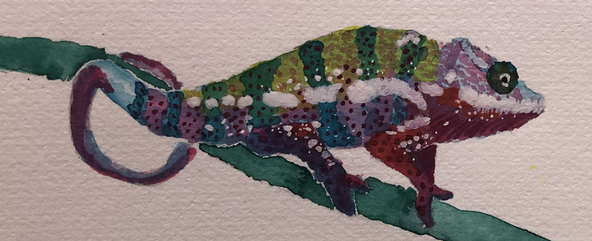

## Hello! I'm Rutendo!

### About me

I'm a Computational Biologist who enjoys tackling various biological problems using Statistical Methods and Machine Learning. I'm also passionate about the learning process and learning new skills! 

I've contributed to various projects that include:

1. Development of [TFEA](https://github.com/Dowell-Lab/TFEA), a tool to determine transcription factor activity from nascent RNA sequencing data.
2. Apply [signal processing and machine learning techniques](https://github.com/rutendos/genome_wavelets/blob/master/Rocky2019_Sigauke_Slides.pdf) to predict nascent RNA sequencing experiments from the raw data.
3. Build a database ([DBNascent](https://nascent.colorado.edu/home/)) of nascent RNA sequencing experiments across 20 organisms.
4. Applying [statistical analyses](https://github.com/Dowell-Lab/bidir_gene_pairs/tree/windowed_correlations) to determine regulatory regions linked to genes in human tissues.
5. [Whiptail lizard](https://elifesciences.org/articles/97035) genomes 🦎 analyses. I contributed to the analysis of the synteny of the genomes and the repeat element content of the genomes. 

### Development tools

### Fun facts
- In the last couple of years, I've picked up running 🏃‍♀️. My goal is to increase mileage each year 😅.
  
- In my free time, I also enjoy drawing and painting.

<figure class="center">
    
    <figcaption>Here is a painting of a chameleon using watercolor paint and details added with acrylic paint (painted March 17, 2021).</figcaption>
</figure>

### Contact details

My email address is rfsigauke@gmail.com. Feel free to email and connect with me!

